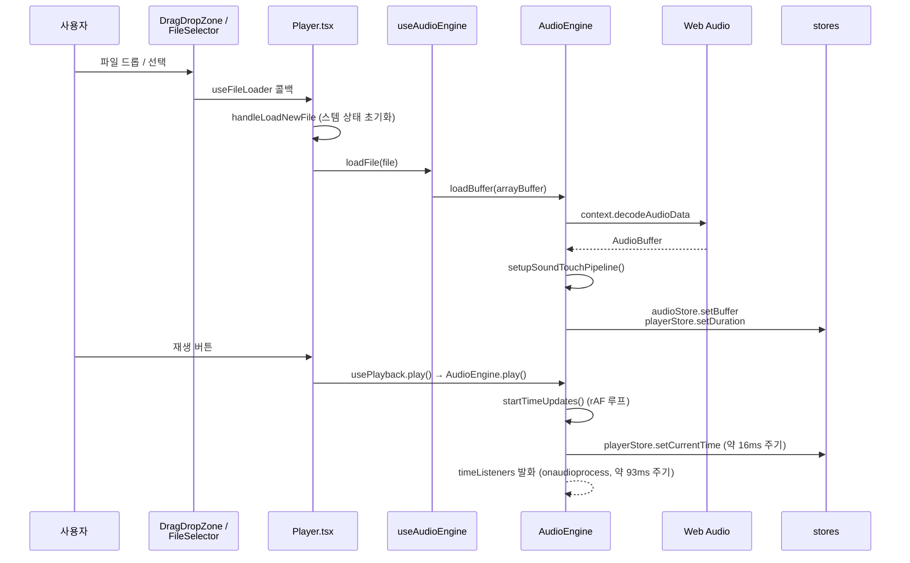
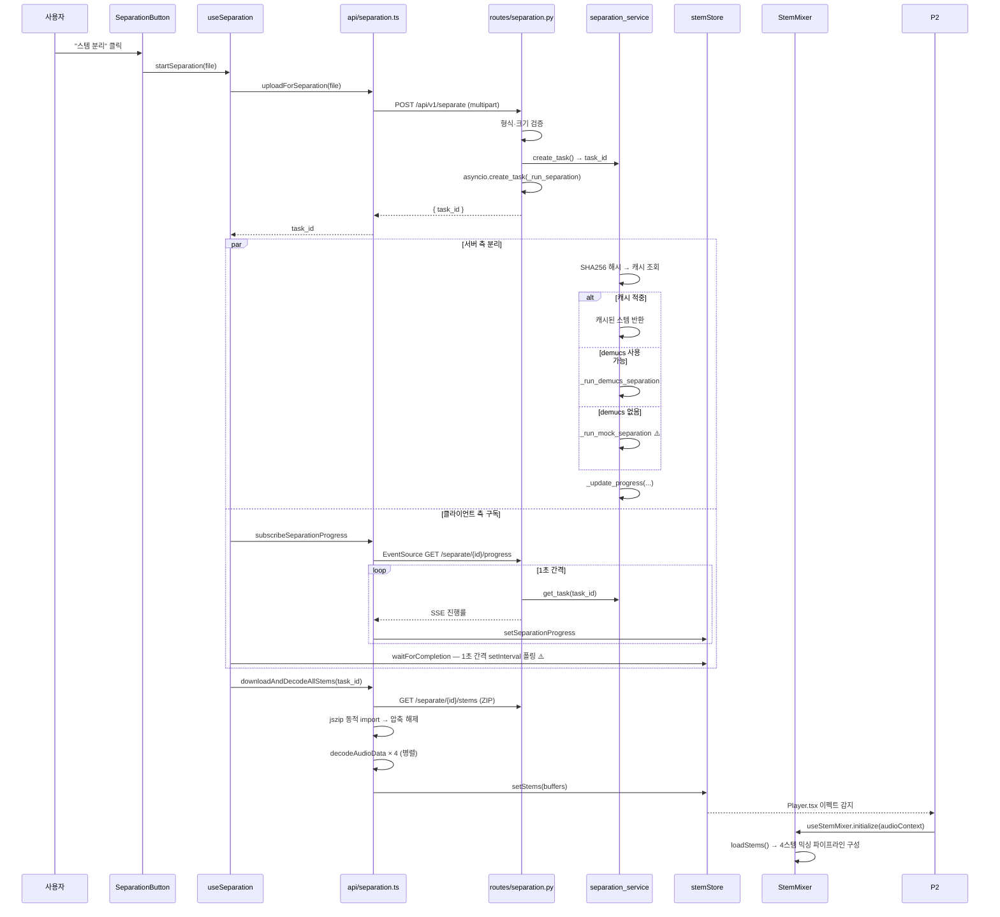
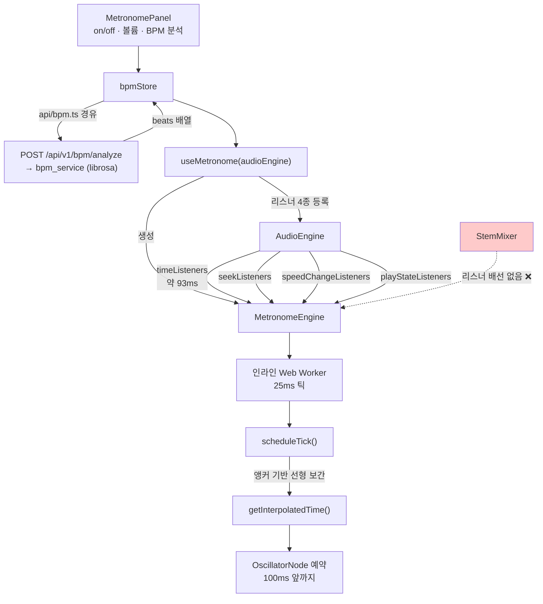

# 핵심 데이터 흐름

> 5가지 주요 흐름을 함수 단위로 추적합니다. 흐름별 진입 UI → 종착지 순서입니다.
> 상위 문서: [overview.md](./overview.md)

---

## ① 로컬 파일 → 재생

가장 기본이 되는 경로입니다. YouTube 변환(③)도 마지막에 이 흐름으로 합류합니다.



**오디오 그래프 구성:**

```
WebAudioBufferSource → SimpleFilter(SoundTouch) → ScriptProcessorNode
  → GainNode → AnalyserNode → destination
```

`ScriptProcessorNode`를 쓰기 때문에 속도·피치 변환이 오디오 스레드가 아닌 메인 스레드에서 일어납니다. 버퍼 주기가 약 93ms이며, 이 값이 메트로놈 동기화(④)의 정밀도 하한을 결정합니다.

**시간 업데이트가 두 경로로 나뉩니다** — 이 설계가 메트로놈 지연 문제의 해법입니다:

| 경로 | 주기 | 소비자 | 목적 |
|---|---|---|---|
| rAF 루프 → `playerStore.setCurrentTime` | 약 16ms | React UI (시간 표시·파형 커서) | 화면 갱신 |
| `timeListeners` (onaudioprocess에서 발화) | 약 93ms | `MetronomeEngine.syncToPlaybackTime` | React를 우회한 정밀 앵커 동기화 |

---

## ② 스템 분리

가장 긴 흐름입니다. 프론트엔드 → 백엔드 → 다시 프론트엔드 재생까지 왕복합니다.



### 이 흐름에서 알아야 할 세 가지

**⚠️ 이중 폴링.** SSE 스트림이 이미 진행률을 밀어 주는데, `useSeparation.waitForCompletion`이 `stemStore` 상태를 1초 간격 `setInterval`로 또 폴링합니다. 완료 판정은 폴링 쪽에서 내리므로 SSE는 사실상 UI 진행률 표시 전용입니다. 서버도 `get_task`를 1초마다 폴링해 SSE를 만들어 내므로, 한 번의 분리 작업에 폴링 루프가 세 겹으로 쌓입니다.

**⚠️ 조용한 mock 대체.** demucs/torch가 설치되지 않은 환경에서 `_run_mock_separation`이 (ffmpeg가 있으면) 원본을 4개 스템 슬롯에 그대로 복사하거나, (ffmpeg도 없으면) `_create_silent_wav`로 5초 무음 WAV를 만듭니다. 서버 로그에 경고만 남고, `SeparationResponse` / `SeparationProgress` 스키마에는 이를 알리는 필드가 없습니다. **프론트엔드는 진짜 분리로 인식합니다.**

**AudioContext 공유가 필수입니다.** 스템 디코드에 쓴 `AudioContext`와 `StemMixer`가 쓰는 것이 같아야 합니다. sampleRate가 다르면 재생 속도가 어긋나기 때문에 `Player.tsx`가 같은 컨텍스트를 명시적으로 넘깁니다.

---

## ③ YouTube 변환

```
YouTubeInput / YouTubeSection
  └─ useYouTubeConvert.convertUrl(url)
       ├─ isValidYouTubeUrl(url)                       ← 클라이언트 정규식 사전 검증
       ├─ convertYouTubeUrl  (api/youtube.ts)
       │    └─ apiClient.post('/youtube/convert')      ← client.ts를 쓰는 유일한 경로
       │         └─ POST /api/v1/youtube/convert
       │              ├─ rate_limiter.check_rate_limit(client_ip)   ← 유일한 레이트 리밋 지점
       │              ├─ validators.validate_youtube_url(url)       ← 호스트/스킴 허용목록
       │              └─ youtube_service.create_task() + yt-dlp 백그라운드 실행
       ├─ connectProgress  (api/youtube.ts)
       │    └─ EventSource GET /youtube/progress/{task_id}
       │         └─ 수동 지수 백오프 재연결 (최대 3회)
       │              └─ youtubeStore.setProgress
       └─ status === 'complete' 시:
            ├─ getDownloadUrl(task_id) 로 직접 fetch
            │    (SSE 페이로드의 download_url은 상대 경로라 사용하지 않음)
            ├─ 받은 바이트를 File 객체로 래핑
            └─ onFileReady(file)  →  Player의 loadFile  →  흐름 ①로 합류
```

이 흐름은 **끝에서 흐름 ①의 중간 지점으로 되돌아갑니다.** 변환된 MP3는 사용자가 직접 드롭한 파일과 완전히 동일하게 취급됩니다.

---

## ④ 메트로놈

React 렌더 주기에 의존하지 않는 것이 이 흐름의 핵심입니다.



### 왜 이렇게 복잡한가

오디오 버퍼 주기(약 93ms)마다 들어오는 시간 정보만으로 클릭을 울리면 최대 93ms 지연이 생깁니다. 그래서:

1. `AudioEngine`이 버퍼마다 정확한 재생 위치를 **앵커**로 넘깁니다 (`syncToPlaybackTime`).
2. `MetronomeEngine`이 앵커 시각과 `AudioContext.currentTime`을 함께 기록합니다.
3. 25ms 워커 틱마다 앵커에서 선형 외삽해 현재 위치를 추정합니다 (`getInterpolatedTime`).
4. 추정 위치 기준으로 100ms 앞까지의 비트를 `OscillatorNode` 스케줄로 미리 걸어 둡니다.

속도가 바뀌면 외삽 기울기가 달라지므로 `AudioEngine.setSpeed`가 `speedChangeListeners`를 즉시 발화해 앵커를 다시 잡습니다.

### ❌ 스템 모드에서는 동작하지 않습니다

`useMetronome`은 `AudioEngine`에만 배선됩니다. `StemMixer`에는 대응하는 리스너 집합 자체가 없어, 스템 모드로 전환하면 메트로놈이 조용히 멈춥니다. 코드 어디에도 이 제약이 문서화되어 있지 않습니다.

### BPM 요청 경로 — **[정리됨]**

이전에는 `bpmStore.analyzeBpm`이 스토어 안에서 직접 `fetch`를 호출하며 `VITE_API_URL`을 읽었습니다. 지금은 `src/api/bpm.ts`에 위임하고, 그 파일은 `apiClient.getFullUrl()`로 베이스 URL을 얻습니다:

```
MetronomePanel → bpmStore.analyzeBpm
                   └─ api/bpm.ts analyzeBpm
                        └─ apiClient.getFullUrl('/bpm/analyze')   ← client.ts:7 이 유일한 소유자
                             └─ POST /api/v1/bpm/analyze
```

[dependencies.md의 계층 위반 ③](./dependencies.md) 참조.

---

## ⑤ 속도 · 피치 조절

```
SpeedControl / PitchControl
  └─ controlStore.setSpeed / setPitch      ← SPEED_PITCH.MIN/MAX 로 클램프
       └─ useSpeedPitch(activeEngine) 이펙트
            └─ engine.setSpeed(speed) / engine.setPitch(pitch)
                 │
                 ├─ AudioEngine.setSpeed
                 │    ├─ this.soundtouch.tempo = speed
                 │    └─ speedChangeListeners 발화 → MetronomeEngine 앵커 재설정
                 │
                 └─ StemMixer.setSpeed
                      └─ this.soundtouch.tempo = speed
                         (리스너 발화 없음 — ④의 제약과 동일한 원인)
```

`activeEngine`은 `Player.tsx`가 스템 모드 여부로 결정합니다. 두 클래스의 `setSpeed`/`setPitch`는 구조적으로 동일합니다.

**디바운스가 없는 이유:** SoundTouch가 다음 `onaudioprocess` 청크를 처리할 때 변경된 `tempo`/`pitchSemitones` 값을 읽어가므로, 슬라이더를 빠르게 움직여도 재계산 폭주가 일어나지 않습니다. 값 대입 자체가 O(1)입니다.

**속도와 피치가 독립적입니다.** 이 프로젝트가 soundtouchjs를 쓰는 이유가 이것입니다. `playbackRate`만 바꾸면 음정이 함께 올라가는데, SoundTouch는 시간 신축과 피치 시프트를 분리해 처리합니다.

---

## 흐름 간 접점 요약

| 접점 | 위치 | 성격 |
|---|---|---|
| ③ → ① | `onFileReady` → `Player.loadFile` | YouTube 결과가 로컬 파일과 동일 경로로 합류 |
| ② → 재생 | `Player.tsx` 이펙트 → `useStemMixer.initialize` | 스템 로드 완료 시 엔진 전환 트리거 |
| ① ↔ ② 전환 | `Player.tsx` 위치 동기화 블록 | 두 엔진의 `currentTime`을 손으로 맞춤 — 스토어가 불변식을 강제하지 않음 |
| ① → ④ | `AudioEngine` 리스너 4종 | React 우회 정밀 동기화 |
| ⑤ → ④ | `speedChangeListeners` | 속도 변경 시 비트 시계 재앵커 |
| ② → ④ | **없음** | 스템 모드에서 메트로놈 미동작 |

---

*모듈별 책임은 [modules.md](./modules.md), import 그래프는 [dependencies.md](./dependencies.md)를 보세요.*
