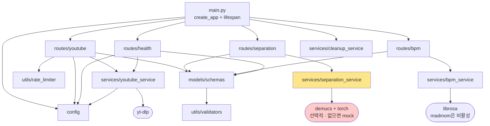

# 의존 관계 그래프

> 추출 방법: `grep`으로 `src/**/*.{ts,tsx}`의 상대·별칭 import와 `backend/app/**/*.py`의 `from app.*` import를 전수 수집.
> 상위 문서: [overview.md](./overview.md)

## 프론트엔드 계층 그래프

배럴 `index.ts` 파일은 노이즈라 생략했습니다.

```mermaid
graph TD
    main[main.tsx] --> App[App.tsx]
    App --> Player["Player.tsx<br/>조립 루트"]

    Player --> hAE[useAudioEngine]
    Player --> hSM[useStemMixer]
    Player --> hPB[usePlayback]
    Player --> hSP[useSpeedPitch]
    Player --> hMet[useMetronome]
    Player --> hSep[useSeparation]
    Player --> hWF[useWaveform]
    Player --> hKB[useKeyboardShortcuts]
    Player --> hFL[useFileLoader]
    Player --> UIPANELS["패널 컴포넌트 11종<br/>ABLoop · Controls · Volume ·<br/>SpeedPitch · Metronome ·<br/>StemMixer · YouTube · Layout · Waveform"]

    hAE --> AE[core/AudioEngine]
    hPB --> AE
    hPB --> SM[core/StemMixer]
    hSP --> AE
    hSP --> SM
    hSM --> SM
    hMet --> AE
    hMet --> ME[core/MetronomeEngine]
    hSep --> apiSep[api/separation]
    hYT[useYouTubeConvert] --> apiYT[api/youtube]
    hYT --> apiCli[api/client]
    apiYT --> apiCli
    apiBpm[api/bpm] --> apiCli

    hAE --> stores
    hPB --> stores
    hSP --> stores
    hSM --> stores
    hSep --> stores
    hMet --> stores
    hKB --> stores
    hWF --> stores
    UIPANELS --> stores

    stores["stores/ (Zustand 7개)<br/>audio · player · control · loop ·<br/>stem · bpm · youtube"]

    AE --> const[utils/constants]
    SM -.위반.-> stores
    apiSep -.위반.-> stores
    stores --> apiBpm
    apiCli --> BE(("백엔드<br/>/api/v1"))
    apiSep --> BE

    ME -.dead: core/index.ts만.-> DEAD["미사용<br/>ABLoopManager · WaveformRenderer<br/>workers/metronome-worker"]

    style Player fill:#fde68a
    style DEAD fill:#fecaca
    style stores fill:#bfdbfe
```

## 백엔드 그래프



레이트 리밋(`utils/rate_limiter`)이 `routes/youtube`에만 연결된 것이 그래프에서 그대로 보입니다.

## Fan-in 순위 (프론트엔드 내부)

import되는 횟수 기준입니다. 상위 항목이 곧 변경 파급 범위가 가장 큰 모듈입니다.

| 순위 | 대상 | 참조 수 | 성격 |
|---:|---|---:|---|
| 1 | `stores/stemStore` | 12 | 사실상 공유 커널. UI 5곳 + 훅 4곳 + `core/StemMixer` + `api/separation` |
| 2 | `utils/constants` | 9 | 상수 (일부는 소비되지 않음) |
| 3 | `stores/audioStore` | 7 | |
| 4 | `stores/loopStore` | 5 | |
| 4 | `stores/controlStore` | 5 | |
| 4 | `core/AudioEngine` | 5 | 도메인 커널 |
| 7 | `stores/playerStore` | 4 | |
| 8 | `core/StemMixer` | 3 | |

`stemStore`가 1위인 것은 [modules.md](./modules.md)에 적은 대로 이 스토어 하나가 분리 태스크 상태·오디오 버퍼·믹서 게인 세 가지를 함께 들고 있기 때문입니다. 세 가지를 쓰는 곳이 각각 달라 참조가 누적됐습니다.

## 순환 의존

**발견되지 않았습니다.** 확인한 규칙:

- `src/core/**`는 `stores/`·`hooks/`·`components/`를 import하지 않습니다 — 단 1건 예외(아래 위반 ①).
- `src/stores/**`는 `core/`를 import하지 않습니다.
- `src/hooks/**`가 `core/`와 `stores/` 사이를 단방향으로 중개합니다.
- 백엔드: `routes → services → config` 단방향. `services`가 `routes`를 import하는 곳은 없습니다.

## 계층 위반

직접 확인한 4건입니다.

### ① 도메인 엔진이 UI 스토어를 import — `src/core/StemMixer.ts → ../stores/stemStore`

`core/`가 React 상태 계층을 향해 위쪽으로 의존합니다. 이 한 줄 때문에 `StemMixer`를 React 밖에서 단독 테스트하거나 재사용할 수 없습니다.

### ② API 계층이 UI 스토어를 import — `src/api/separation.ts → ../stores/stemStore`

통합 계층이 상태 계층에 직접 씁니다. SSE 진행률을 받아 스토어에 바로 반영하는 구조인데, 반환값으로 넘기고 훅이 쓰는 형태였다면 방향이 유지됐을 것입니다.

### ③ 스토어가 직접 네트워크 호출 — **[해결됨]**

이전에는 `bpmStore.ts`가 스토어 액션 안에서 직접 `fetch`를 호출하며 `VITE_API_URL`이라는 **별도 환경변수**를 읽었습니다. 같은 일을 하는 `src/api/bpm.ts`가 이미 있었지만 아무도 import하지 않아, 동일 엔드포인트 호출이 두 벌 존재하고 서로 다른 변수를 읽는 상태였습니다.

**수정 내용** (2026-09-05):

- `bpmStore.analyzeBpm`이 `src/api/bpm.ts`의 `analyzeBpm`에 위임합니다. 스토어에서 `fetch`와 로컬 `API_BASE_URL`을 제거했습니다.
- `src/api/bpm.ts`가 자체 `import.meta.env` 대신 `apiClient.getFullUrl('/bpm/analyze')`를 씁니다.

**현재 환경변수 지점** — 전부 `VITE_API_BASE_URL` 하나입니다:

| 위치 | 환경변수 | 기본값 |
|---|---|---|
| `api/client.ts:7` | `VITE_API_BASE_URL` | `http://localhost:8000` |
| `api/separation.ts:45` | `VITE_API_BASE_URL` | `http://localhost:8000` |

`api/bpm.ts`는 이제 환경변수를 직접 읽지 않고 `client.ts`의 값을 빌려 씁니다. `separation.ts`는 변수·기본값이 `client.ts`와 동일해 동작 차이는 없지만, 여전히 중복 정의입니다 — `apiClient`로 통일하면 소유자가 하나로 줄어듭니다.

### ④ 라우트가 서비스의 private 메서드 호출 — `backend/app/routes/separation.py:131,136`

```python
separation_service._update_progress(...)
```

밑줄 접두 메서드를 라우트 모듈이 직접 부릅니다. 서비스가 내부 구현을 바꾸면 라우트가 깨집니다.

## 외부 의존성

### 프론트엔드 (`package.json` runtime)

| 라이브러리 | 버전 | 사용처 |
|---|---|---|
| `react` / `react-dom` | ^19.0.0 | 전역 |
| `zustand` | ^5.0.2 | `src/stores/**` 7개 전부 |
| `soundtouchjs` | ^0.3.0 | `core/AudioEngine.ts`, `core/StemMixer.ts` — 속도·피치 독립 조절의 핵심. 타입 미제공이라 `src/types/soundtouchjs.d.ts`에 직접 선언 |
| `wavesurfer.js` | ^7.8.6 | `hooks/useWaveform.ts` (regions 플러그인 포함). `core/WaveformRenderer.ts`도 같은 라이브러리를 감싸지만 미사용 |
| `jszip` | ^3.10.1 | `api/separation.ts`에서 동적 import — 전체 스템 ZIP 해제 전용 |
| `lucide-react` | ^0.564.0 | `components/**` 아이콘, `stemStore.ts`의 아이콘 이름 매핑 |

빌드/테스트 계열: Vite 6, TypeScript 5.7, Tailwind 4, Vitest 4 + Testing Library, Playwright 1.48, ESLint 9, Prettier 3.

### 백엔드 (`backend/requirements.txt`)

| 라이브러리 | 사용처 | 비고 |
|---|---|---|
| `fastapi` / `uvicorn[standard]` | `main.py` | |
| `pydantic` / `pydantic-settings` | `config.py`, `models/schemas.py` | |
| `sse-starlette` | `routes/separation.py`, `routes/youtube.py` | `EventSourceResponse` |
| `python-multipart` | `routes/separation.py`, `routes/bpm.py` | `UploadFile` 파싱에 필수 |
| `aiofiles` | `routes/separation.py` | 업로드 임시 파일 비동기 쓰기 |
| `yt-dlp` | `services/youtube_service.py` | |
| `demucs` + `torchaudio` (+`torch`) | `services/separation_service.py` | **선택적.** 없으면 mock 경로 |
| `librosa` + `numpy` | `services/bpm_service.py` | 실제로 실행되는 유일한 BPM 경로 |
| `httpx` | — | requirements에 있으나 `backend/app/` 안에서 직접 사용처를 찾지 못했습니다. 테스트나 전이 의존으로 보입니다 |
| `madmom` | `services/bpm_service.py` | **requirements에서 주석 처리됨** (Python 3.13 Cython 빌드 실패). 코드는 남아 있으나 도달 불가 |
| `pytest` / `pytest-asyncio` | `backend/tests/**` | |

## 죽은 코드 요약

| 파일 | 줄 | export 위치 | 실제 구현이 있는 곳 |
|---|---:|---|---|
| `src/core/ABLoopManager.ts` | 165 | `core/index.ts:8` | `hooks/useAudioEngine.ts`, `hooks/useStemMixer.ts`에 인라인 |
| `src/core/WaveformRenderer.ts` | 271 | `core/index.ts:9` | `hooks/useWaveform.ts`가 wavesurfer를 직접 생성 |
| `src/workers/metronome-worker.ts` | 41 | — | `core/MetronomeEngine.ts` 안에 문자열로 인라인 후 Blob URL 생성 |

합계 477줄. (`src/api/bpm.ts` 53줄은 위반 ③ 수정으로 실사용 코드가 되어 목록에서 빠졌습니다.) 제거 전에는 `/moai clean`으로 테스트 검증을 거치는 편이 안전합니다.

---

*동작 순서는 [data-flow.md](./data-flow.md), 진입점은 [entry-points.md](./entry-points.md)를 보세요.*
