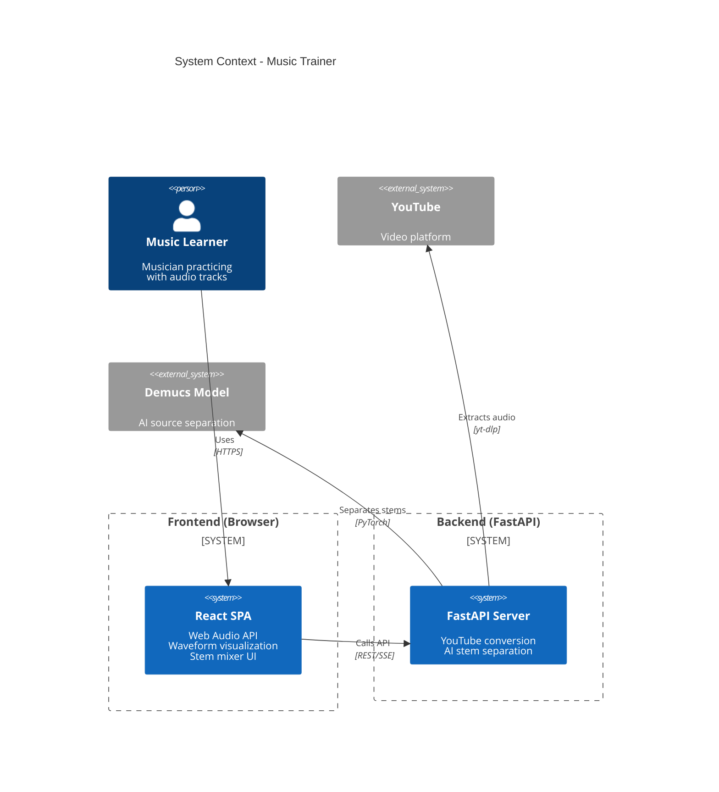
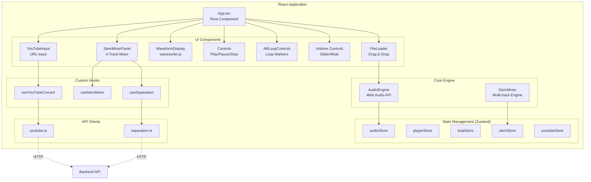
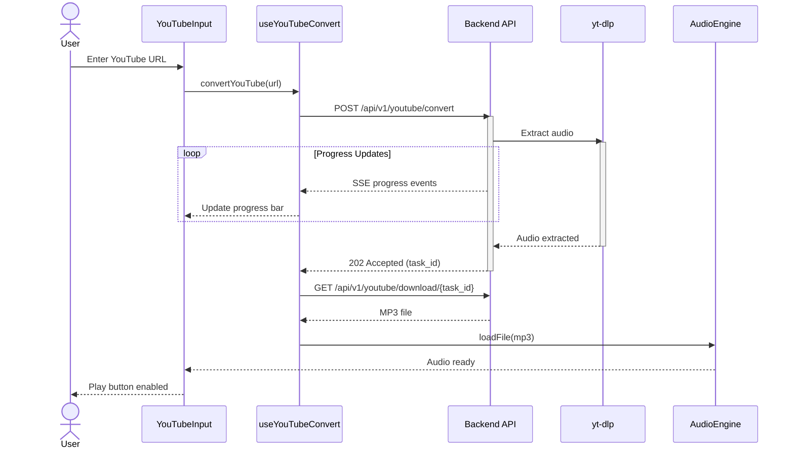
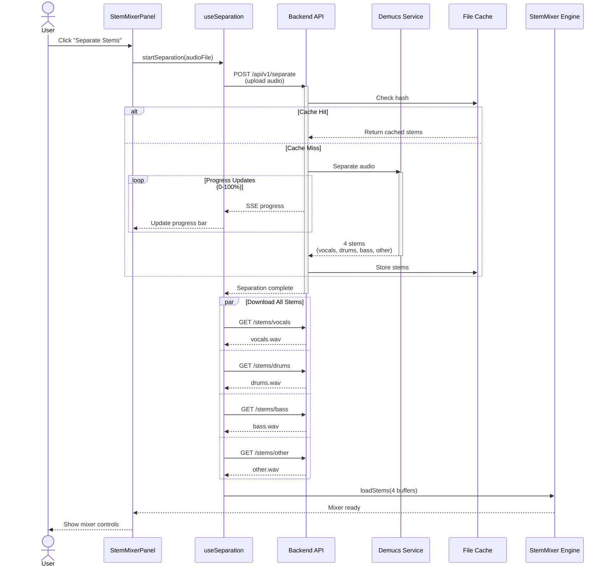
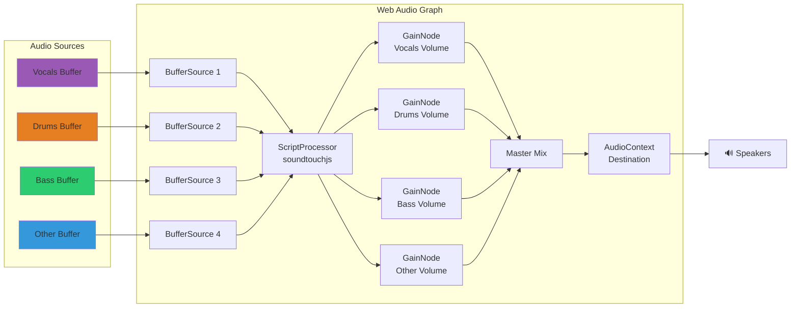

# Music Trainer

기타 연습을 위한 웹 기반 오디오 트레이너입니다. A-B 루프, 파형 시각화, 키보드 단축키를 지원하여 효과적인 악기 연습 환경을 제공합니다.

## 주요 기능

- **오디오 파일 로드**: MP3, WAV, M4A, OGG 형식 지원 (드래그 앤 드롭)
- **YouTube 변환 (Convert)**: YouTube URL에서 MP3 추출 및 자동 로드 (실시간 진행률 표시)
- **재생 중 파일 교체**: 재생 중에도 모달을 통해 새로운 오디오 파일 로드 가능 (YouTube URL 입력 및 파일 드래그 앤 드롭 지원)
- **파형 시각화**: wavesurfer.js를 활용한 부드러운 파형 표시
- **A-B 루프**: 특정 구간 반복 재생으로 연습 효율 향상
- **볼륨 제어**: 0%~100% 마스터 볼륨 및 뮤트 기능
- **Speed Slider**: 재생 속도 범위 슬라이더 (0.5x - 2.0x, 0.01 단계) with 시각적 진행률 표시
- **키보드 단축키**: Space(재생/일시정지), I/O(A/B 지점), Q(A지점 이동), M(뮤트), =/-(속도), [/](피치), R(초기화), 화살표(탐색)
- **스템 믹서 (Stem Mixer)**: AI 기반 음원 분리 기능
  - Demucs htdemucs 모델로 4개 스템 분리 (vocals, drums, bass, other)
  - 실시간 분리 진행률 표시 (SSE)
  - 각 스템별 개별 볼륨 제어 (0-100%)
  - 솔로/뮤트 기능으로 특정 악기 집중 연습
  - SoundTouch 통합으로 속도/피치 동기화
- **BPM 감지 및 메트로놈**: 자동 템포 분석 및 클릭 재생
  - 오디오 로드 시 자동 BPM 분석 (madmom/librosa)
  - 감지된 BPM 및 신뢰도 점수 표시
  - 메트로놈 클릭 재생 (다운비트/업비트 구분)
  - 속도 변경, Seek, A-B 루프와 자동 동기화
  - 독립 메트로놈 볼륨 제어

## Tech Stack

### Frontend
- **React 19.0.0** - UI library
- **TypeScript 5.9.x** - Type-safe JavaScript (strict mode)
- **Vite 6.x** - Build tool and dev server
- **Zustand 5.x** - State management
- **Tailwind CSS 4.x** - Utility-first CSS
- **lucide-react** - Icon library (Lucide icons)
- **wavesurfer.js 7.8.x** - Audio waveform visualization
- **Vitest** - Unit testing (190 tests)
- **Playwright** - E2E testing

### Backend
- **Python 3.12+** - Programming language
- **FastAPI 0.129.0+** - Modern async web framework
- **yt-dlp 2026.2.4+** - YouTube audio extraction
- **ffmpeg** - Audio processing
- **Demucs 4.x** - AI source separation (htdemucs model)
- **PyTorch (CPU)** - ML runtime for Demucs
- **madmom 0.17.0** - BPM detection and beat tracking
- **librosa 0.10.2** - Audio analysis (fallback BPM detection)
- **Uvicorn** - ASGI server
- **pytest** - Testing framework (65 tests)

## Architecture

본 프로젝트는 React 기반 프론트엔드와 FastAPI 기반 백엔드로 구성된 풀스택 웹 애플리케이션입니다. AI 음원 분리와 실시간 오디오 처리를 위해 Web Audio API와 Demucs 모델을 활용합니다.

### System Architecture

전체 시스템은 사용자 브라우저의 React SPA, FastAPI 백엔드 서버, 그리고 외부 서비스(YouTube, Demucs)로 구성됩니다.



### Frontend Component Architecture

프론트엔드는 React 컴포넌트, Zustand 스토어, 커스텀 훅, 그리고 두 개의 오디오 엔진(AudioEngine, StemMixer)으로 구성됩니다.



### YouTube Conversion Flow

사용자가 YouTube URL을 입력하면 백엔드에서 yt-dlp로 오디오를 추출하고, 프론트엔드로 전송하여 AudioEngine에 로드합니다.



### Stem Separation Flow

오디오 파일을 업로드하면 Demucs AI 모델이 4개 스템(vocals, drums, bass, other)으로 분리하고, 캐싱된 결과를 프론트엔드 StemMixer에 로드합니다.



### Audio Processing Pipeline

StemMixer는 4개의 AudioBufferSourceNode를 ScriptProcessorNode(soundtouchjs)를 통해 처리하고, 각 스템의 GainNode로 개별 볼륨을 제어한 후 마스터 믹스로 합쳐 출력합니다.



## Project Structure

```
/ (repository root)
├── src/                        # Frontend
│   ├── api/                   # Backend API client
│   │   ├── separation.ts     # 분리 API 클라이언트 (업로드, SSE, 다운로드)
│   │   └── bpm.ts            # BPM 분석 API 클라이언트
│   ├── components/            # Reusable UI components
│   │   ├── FileLoader/        # File loading components
│   │   │   └── LoadAudioModal.tsx  # Modal for loading new audio during playback
│   │   ├── YouTubeInput/      # YouTube URL input component
│   │   └── Metronome/         # Metronome UI components
│   │       └── MetronomePanel.tsx  # BPM 표시, 토글, 볼륨 UI
│   ├── core/                  # Core business logic
│   │   ├── StemMixer.ts      # 멀티트랙 스템 믹서 오디오 엔진
│   │   └── MetronomeEngine.ts # Lookahead Scheduler, OscillatorNode
│   ├── stores/                # Zustand state stores
│   │   ├── youtubeStore.ts   # YouTube conversion state
│   │   ├── stemStore.ts      # 스템 분리/믹서 상태 관리
│   │   └── bpmStore.ts       # BPM 분석/메트로놈 상태 관리
│   ├── hooks/                 # Custom React hooks
│   │   ├── useYouTubeConvert.ts  # YouTube conversion hook
│   │   ├── useStemMixer.ts       # StemMixer 래퍼 훅
│   │   ├── useSeparation.ts      # 분리 프로세스 관리 훅
│   │   └── useMetronome.ts       # MetronomeEngine 라이프사이클 훅
│   ├── workers/               # Web Workers
│   │   └── metronome-worker.ts  # 메트로놈 타이머 (25ms 루프)
│   ├── utils/                 # Utility functions
│   ├── types/                 # TypeScript type definitions
│   ├── test/                  # Test setup and utilities
│   ├── App.tsx                # Root component
│   ├── main.tsx               # Application entry point
│   └── vite-env.d.ts          # Vite TypeScript declarations
├── backend/                    # Backend
│   ├── app/
│   │   ├── main.py           # FastAPI app entry point
│   │   ├── config.py         # Environment configuration
│   │   ├── routes/           # API routes
│   │   │   ├── health.py     # Health check endpoint
│   │   │   ├── youtube.py    # YouTube conversion endpoints
│   │   │   ├── separation.py # 음원 분리 엔드포인트
│   │   │   └── bpm.py        # BPM 분석 엔드포인트
│   │   ├── services/         # Business logic
│   │   │   ├── youtube_service.py      # yt-dlp wrapper
│   │   │   ├── separation_service.py   # Demucs 래퍼
│   │   │   ├── bpm_service.py          # madmom/librosa BPM 감지
│   │   │   └── cleanup_service.py      # Temporary file cleanup
│   │   ├── models/           # Pydantic schemas
│   │   └── utils/            # Utilities
│   ├── tests/                # Backend tests (65 tests)
│   ├── requirements.txt
│   └── Dockerfile
├── tests/                      # Frontend tests
│   ├── unit/                 # Unit tests
│   ├── component/            # Component tests
│   └── e2e/                  # End-to-end tests (Playwright)
├── public/
│   └── test-audio/           # Test audio files
├── package.json
├── vite.config.ts
├── vitest.config.ts
├── playwright.config.ts
├── tsconfig.json
├── tsconfig.node.json
├── tailwind.config.ts
└── index.html
```

## Development

### Install Dependencies

**Frontend:**
```bash
pnpm install
```

**Backend:**
```bash
cd backend
pip install -r requirements.txt
# ffmpeg 설치 필요 (OS별로 다름)
# macOS: brew install ffmpeg
# Ubuntu: sudo apt-get install ffmpeg
```

### Available Scripts

**Frontend:**
```bash
# Start development server
pnpm dev

# Build for production
pnpm build

# Preview production build
pnpm preview

# Run unit tests
pnpm test

# Run tests with UI
pnpm test:ui

# Run tests with coverage
pnpm test:coverage

# Run E2E tests
pnpm test:e2e

# Lint code
pnpm lint

# Fix linting issues
pnpm lint:fix

# Format code
pnpm format

# Type check
pnpm typecheck
```

**Backend:**
```bash
# Start development server
cd backend
uvicorn app.main:app --reload --host 0.0.0.0 --port 8000

# Run tests
pytest

# Run tests with coverage
pytest --cov=app --cov-report=html

# Run with Docker
docker build -t music-trainer-backend .
docker run -p 8000:8000 music-trainer-backend
```

### Environment Variables

**.env (Backend):**
```
CORS_ORIGINS=["http://localhost:5173","http://localhost:3000"]
MAX_FILE_SIZE_MB=100
TEMP_DIR=/tmp/music-trainer
CLEANUP_INTERVAL_MINUTES=10
FILE_RETENTION_HOURS=1
YOUTUBE_COOKIES=  # base64 인코딩된 YouTube cookies.txt (선택사항)
LOG_LEVEL=INFO   # 환경변수 로드 확인 로깅 포함
```

**환경변수 로드 확인 (v0.3.2+):**

애플리케이션 시작 시 로그에서 환경변수 로드 상태를 확인할 수 있습니다:
```
INFO: YOUTUBE_COOKIES 설정 여부: 설정됨
INFO: CORS_ORIGINS 로드됨: ['http://localhost:5173', 'https://guitar-mp3-trainer.vercel.app']
```

Railway/Vercel 환경에서는 `railway logs` 또는 Vercel 대시보드에서 로그를 확인하세요.

**.env (Frontend):**
```
VITE_API_BASE_URL=http://localhost:8000
```

**YOUTUBE_COOKIES 설정 (선택사항):**

YouTube 로그인 필요 콘텐츠나 연령 제한 영상을 다운로드하려면 쿠키 인증이 필요합니다.

1. 브라우저 확장 프로그램으로 YouTube cookies.txt 추출
   - Chrome/Edge: [Get cookies.txt LOCALLY](https://chromewebstore.google.com/detail/get-cookiestxt-locally/cclelndahbckbenkjhflpdbgdldlbecc)
   - Firefox: [cookies.txt](https://addons.mozilla.org/en-US/firefox/addon/cookies-txt/)

2. 추출한 cookies.txt를 base64로 인코딩
   ```bash
   # macOS/Linux
   base64 -i cookies.txt | tr -d '\n'

   # Windows (PowerShell)
   [Convert]::ToBase64String([IO.File]::ReadAllBytes("cookies.txt"))
   ```

3. 인코딩된 문자열을 YOUTUBE_COOKIES 환경변수에 설정
   ```bash
   export YOUTUBE_COOKIES="<base64-encoded-string>"
   ```

Railway/Vercel 등 클라우드 환경에서는 환경변수 설정 UI에서 동일하게 설정하시면 됩니다.

## Color Scheme

Dark theme colors:

- Background Primary: `#1A1A1A`
- Background Card: `#141414`
- Background Elevated: `#2D2D2D`
- Text Primary: `#F5F5F5`
- Text Secondary: `#9CA3AF`
- Accent Primary (Orange): `#FF6B35`
- Accent Success/Active (Teal): `#00D4AA`
- Stem Vocals (Purple): `#8B5CF6`
- Stem Drums (Red): `#EF4444`
- Stem Bass (Blue): `#3B82F6`
- Stem Other (Green): `#10B981`

Fonts:
- Headings: Oswald (uppercase, tracking-wider)
- Body: Inter
- Monospace: JetBrains Mono

## Testing

- **Unit Tests**: Vitest + React Testing Library (190 tests)
- **E2E Tests**: Playwright
- **Coverage**: v8 (built into Vitest)

## Keyboard Shortcuts

| Key | Action |
|-----|--------|
| Space | Play / Pause |
| I | Set A point |
| O | Set B point |
| Q | Jump to A point (when loop active) |
| M | Toggle mute |
| = / + | Speed up (+0.01) |
| - / _ | Speed down (-0.01) |
| ] | Pitch up (+1 semitone) |
| [ | Pitch down (-1 semitone) |
| R | Reset speed & pitch |
| ← | Seek -5 seconds |
| → | Seek +5 seconds |

## Deployment

### Railway (Backend)

Backend는 Railway에 배포되어 있습니다.

**필수 환경변수:**
- `PORT`: Railway가 자동으로 할당 (동적)
- `CORS_ORIGINS`: 프론트엔드 URL (JSON 배열 형식)
  - 예: `["https://guitar-mp3-trainer.vercel.app"]`
- `YOUTUBE_COOKIES`: (선택사항) base64 인코딩된 YouTube cookies.txt

**알려진 제한사항:**
- Railway 환경변수가 컨테이너에 전달되지 않는 문제가 있습니다.
- 현재는 코드 기본값으로 Vercel 프로덕션 URL이 설정되어 있습니다.
- CORS_ORIGINS 설정이 필요한 경우, 코드 수정 후 재배포가 필요합니다.

### Vercel (Frontend)

Frontend는 Vercel에 배포되어 있습니다.

**필수 환경변수:**
- `VITE_API_BASE_URL`: Railway 백엔드 URL
  - 예: `https://your-railway-app.up.railway.app`

## Known Issues

현재 프로젝트에서 알려진 문제들입니다.

### 1. Railway 환경변수 전달 문제

**문제:**
- Railway 대시보드에서 설정한 환경변수가 Docker 컨테이너 내부로 전달되지 않습니다.
- `CORS_ORIGINS`, `YOUTUBE_COOKIES` 등 런타임 환경변수가 적용되지 않습니다.

**영향:**
- CORS 설정을 동적으로 변경할 수 없습니다.
- YouTube 인증 쿠키를 런타임에 주입할 수 없습니다.

**Workaround:**
- 코드 기본값으로 Vercel 프로덕션 URL을 포함시켰습니다.
- 필요 시 `backend/app/config.py` 파일을 수정하고 재배포합니다.
- `main.py`에서 기동 시 CORS 오리진을 로그로 출력하여 설정값 확인 가능합니다.

**추적:**
- Railway 공식 문서 및 커뮤니티 포럼 조사 중
- 대안으로 Dockerfile ENV 선언 또는 railway.toml 활용 검토 중

### 2. 음원 분리(Stem Separation) 메모리 부족 문제 (✅ 해결됨)

**문제 (v0.3.1 이전):**
- Demucs 모델을 사용한 음원 분리 작업이 Railway 환경에서 OOM(Out of Memory)으로 실패
- 피크 메모리 사용량: ~1.5GB, Railway 무료 플랜 RAM 제한(512MB) 초과
- 긴 오디오 파일(6분 이상)의 경우 분리 작업 중단

**해결 방법 (v0.3.2):**
- Demucs `split=True` 옵션 적용으로 메모리 79% 감소 (~318MB)
- Railway 무료 플랜 환경에서 374.6초(6.2분) 오디오 안정적 처리 확인
- Related: SPEC-BACKEND-001 Phase 2

**현재 상태:**
- 5-7분 오디오 분리 정상 동작
- 10분 이상 초장시간 오디오는 여전히 타임아웃 가능 (CPU 기반 처리)
- 권장: 7분 이하 오디오 파일 사용

## Quality Standards

- TypeScript strict mode enabled
- ESLint for linting
- Prettier for formatting
- 85%+ test coverage target

## License

MIT
